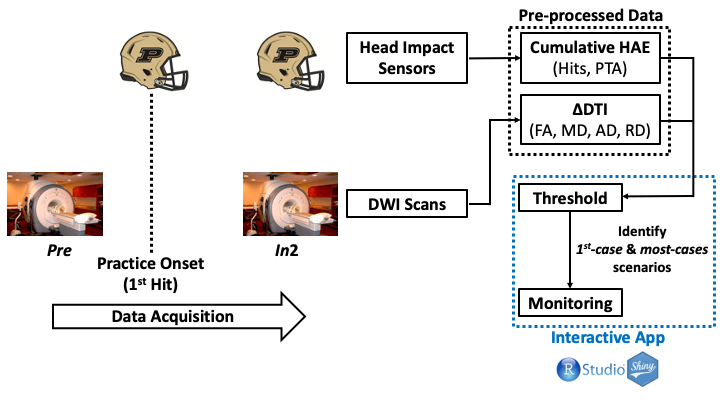
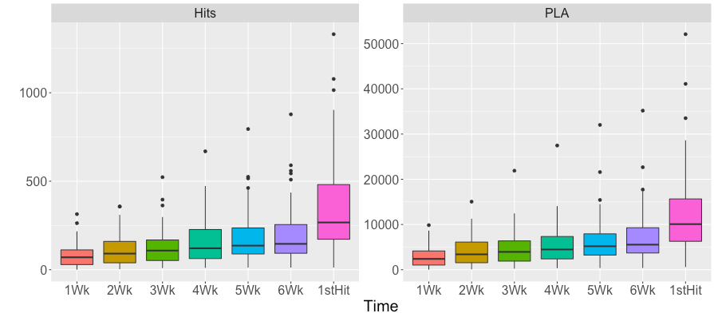
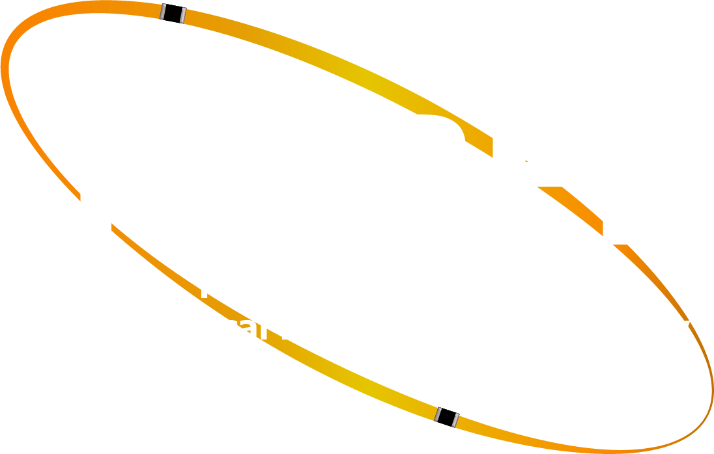
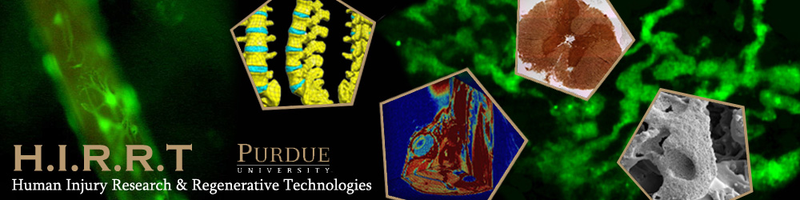

Table of Contents
=================
 * [Overview](#overview)
 * [How to navigate through the menu](#How-to)
     1. [Threshold](#How-to-1-threshold)
     2. [Monitoring](#How-to-2-monitoring)
 * [List of Abbreviations](#list-of-abbr)
 * [References](#references)
 * [Acknowledgments](#acknowledgments)
 

## Overview

This interactive app presents a model for monitoring the brain health of early-to-middle adolescent collision-sport athletes, identifying at-risk individuals during the competition season, so as to inform preventative strategies and avoid deficits persisting to post-season. The model integrates data of two sources: diffusion-weighted imaging (DWI) and head impact sensors respectively. A pipeline is demonstrated on top, and the main functionalities, **Threshold** and **Monitoring** panels, are explained in details below. This app was developed by [Yukai Zou](https://web.ics.purdue.edu/~zou75/) at Weldon School of Biomedical Engineering, Purdue University.

In this app, a dataset composed of 45 high school football athletes is used. The DWI data were acquired by a 3T GE MRI scanner (General Electrics, Waukesha, WI), at approximately one month before the competition season (*Pre*) and the second six-week period during the season (*In2*). DTI metrics, including FA, MD, AD, and RD, were computed after pre-processing. A white matter atlas was used to extract the DTI metrics within each ROI, followed by calculating the change from *Pre* to *In2*. Exposure to HAE during the season was recorded using xPatch (X2 Biosystems; Seattle, WA), a head-based sensors that monitor the number and magnitude of HAE. After pre-processing, cumulative HAE were computed with regard to a series of time prior to *In2*, including hits and PTA. An overview is provided by the box-whisker diagram below:

  

In the diagram above, the *x*-axis represents the duration of HAE recording prior to *In2*, e.g. `1Wk` refers to "since one week prior to *In2*". Note that `1stHit` is approximately 10 weeks prior to *In2*, which occurred after the DWI scans at *Pre*. The *y*-axis represents cumulative counts (for `Hits`) or cumulative *g* (for `PTA`). As the duration increased, the range of cumulative HAE expanded.

There are two analytic panels in this app: 
- The **Threshold** panel addresses how to determine the thresholds for HAE exposure when neural injury starts to develop, and when the injuries are developed to an extent that warrants immediate preventative strategies;
- The **Monitoring** panel examines individual footbal players by overlaying their temporal profile of HAE exposure to the thresholds determined by the **Threshold** panel.

## How to navigate through the menu

### 1. Threshold

This panel presents the statistical analyses for investigating whether the observed abnormalities (defined as an *alteration of the distribution the DTI change*) was dependent on the postulated *cumulative HAE threshold*. Pearson's Chi-square statistics were performed on a contingency table where each participant was categorized as:
1) exhibiting *positive* or *negative* change of the DTI metric;
2) being *above* or *below* the postulated threshold.

The sidebar panel contains several components that require inputs from users:  
- **Since When:** A select box for users to determine the time frame of the analysis, from *1 week prior to In2* up to the recorded *1st hit (~10 weeks prior to In2)*;
- **HAE Type:** A select box for users to control the type of cumulative HAE data to be either *hits* or *peak translational acceleration (PTA)*;
- **HAE Threshold:** A slider with a range of values, with respect to the Time (**Since when**) and **HAE Type** defined by users. By varying the value, Pearson's Chi-square statistics will be calculated, with significant findings and plots presented on the main panel;
- **View Individuals By:** A set of radio buttons where users can control the labeling of individual points, with respect to the *years of high school experience (YoE)*, *status for concussion history (HoCStatus)*, *attention-deficit/hyperactivity disorder (ADHD)*, or *lineman/non-lineman position on the field*.

After getting the inputs, several items will be displayed on the main panel:  
- A **data table** summarizing the significant findings from the Pearson's Chi-square statistics.
   - The findings are sorted by the corresponding *p*-value in ascending order, as is indicated by the ID;
   - The table contains information for the specific DTI metric and the ROI.
- A series of **interactive plots** demonstrating each of the significant findings summarized in the **data table**. 
   - The plots are arranged in the order of the ID;
   - Under each tab, a text is provided to interpret the corrsponding Pearson's Chi-square statistics;
   - On the plot, the blue vertical line refers to the user-defined HAE threshold, the dashed line separates the individual points into either an increase or decrease of the specific DTI metric. By clicking on the points, users can find out specific information about the individuals, including the subjectID, cumulative HAE, and the magnitude of DTI change.

### 2. Monitoring

This panel is designed for visualizing the observations from specific individuals by overlaying on a longitudinal monitoring profile, which may be used to identify at-risk individuals during the season, inform preventative strategies, and avoid deficits persisting to post-season.

The sidebar panel contains several components:  
- **Select Subjects**: A select box for users to choose observations from specific subject to overlay on the plot in the main panel;
- **View in Log-log scale**: A checkbox for controlling the plot in log-log (default) or original scale.

On the main panel, plots for the relationship between the cumulative HAE per week and the time prior to In2, with respect to **Cumulative Hits** and **Cumulative PTA**. The points denote two types of scenarios:
- *1st-case* scenario, where the 1st significant finding was observed; 
- *most-cases* scenario, where the maximum counts of significant findings were achieved.

Both scenarios were determined from the analyses in **Threshold** panel. For the log-log scale, the fitted lines from linear regression were plotted with respect to each scenario. Data points from the selected subject will be overlaid on the plots, so that their positions can be visually compared to both scenarios.

## List of Abbreviations

- **AD:** Axial diffusivity
- **ADHD:** Attention-deficit / hyperactivity disorder
- **DWI:** Diffusion-weighted imaging
- **DTI:** Diffusion tensor imaging
- **FA:** Fractional anisotropy
- **HAE:** Head acceleration event
- **HoC:** History of Concussion
- **L/R:** Left/right hemisphere
- **MD:** Mean diffusivity
- **MRI:** Magnetic resonance imaging
- **PTA:** Peak Translational Acceleration
- **RD:** Radial diffusivity
- **ROI:** Region of interest
- **TBI:** Traumatic brain injury
- **YoE:** Years of high school experience

## References

1. Asato, M, et al. (2010). [White matter development in adolescence: a DTI study](https://doi.org/10.1093/cercor/bhp282). *Cereb Cortex*. 20(9), 2122-2131.
2. Jang I, et al. [Every hit matters: White matter diffusivity changes in high school football athletes are correlated with repetitive head acceleration event exposure](https://doi.org/10.1016/j.nicl.2019.101930). *NeuroImage Clin*. 2019; 24: 101930.
3. Nauman, E.A., et al. (2015). [Post-season neurophysiological deficits assessed by ImPACT and fMRI in athletes competing in American football](https://doi.org/10.1080/87565641.2015.1016161). *Dev Neuropsychol*. 40, 85–91.
4. Nauman, E.A., and Talavage, T.M. (2018). [Subconcussive trauma](https://doi.org/10.1016/b978-0-444-63954-7.00024-0). *Handb Clin Neurol*. 158, 245–255.
5. Nauman, E.A., Talavage, T.M., and Auerbach, P.S. (2020). [Mitigating the Consequences of Subconcussive Head Injuries](https://doi.org/10.1146/annurev-bioeng-091219-053447). *Annu Rev Biomed Eng*. 22(1), 387-407.
6. Pfefferbaum, A., et al. (1994). [A quantitative magnetic resonance imaging study of changes in brain morphology from infancy to late adulthood](https://doi.org/10.1001/archneur.1994.00540210046012). *Arch Neurol*. 51(9), 874-887.
7. Schmithorst, V., and Yuan, W. (2010). [White matter development during adolescence as shown by diffusion MRI](https://doi.org/10.1016/j.bandc.2009.06.005). *Brain Cogn*. 72(1), 16-25.
8. Talavage, T.M. et al. (2014). [Functionally-Detected Cognitive Impairment in High School Football Players without Clinically-Diagnosed Concussion](https://doi.org/10.1089/neu.2010.1512). *J Neurotrauma*. 31, 327–338.
9. Talavage, T.M., Nauman, E.A., and Leverenz, L.J. (2016). [The role of medical imaging in the recharacterization of mild traumatic brain injury using youth sports as a laboratory](https://doi.org/10.3389/fneur.2015.00273). *Front Neurol*. 6, 273.

## Acknowledgments

